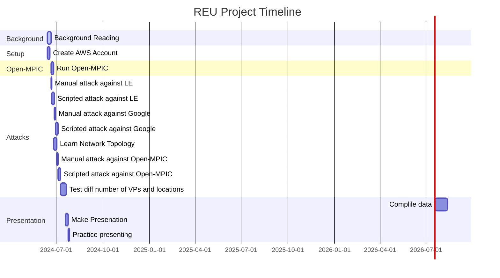

# Princeton-Intel-REU-

```mermaid
gantt
dateFormat  YYYY-MM-DD
title REU Project Timeline
section Background
    Background Reading: active, rev1, 2024-06-14, 1w
section Setup
    Create AWS Account: aws-setup, 2024-06-14, 5d
section Open-MPIC
    Run Open-MPIC: open-mpic, 2024-06-21, 5d
section Attacks
    Manual attack against LE: manual-le, 2024-06-21, 2d
    Scripted attack against LE: scripted-le, after manual-le, 5d
    Manual attack against Google: scripted-google, after scripted-le, 2d
    Scripted attack against Google: after scripted-google, 5d
    Learn Network Topology: 2024-06-26, 1w
    Manual attack against Open-MPIC: manual-mpic, 2024-07-03, 2d
    Scripted attack against Open-MPIC: after manual-mpic, 5d
    Test diff number of VPs and locations: 2024-07-10, 1.5w
section Presentation
    Complile data: data, after le-attacks, 3.5w
    Make Presenation: slides, 2024-07-20, 5d
    Practice presenting: after slides, 2d
```
