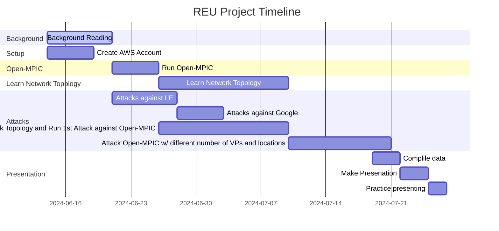

# Princeton-Intel-REU-

```mermaid
gantt
dateFormat  YYYY-MM-DD
title REU Project Timeline
section Background
    Background Reading: active, rev1, 2024-06-14, 1w
section Setup
    Create AWS Account: aws-setup, 2024-06-14, 5d
section Open-MPIC
    Run Open-MPIC: open-mpic, 2024-06-21, 5d
section Learn Network Topology
    Learn Network Topology: topology, 2024-06-26, 2w
section Attacks
    Attacks against LE: le-attacks, 2024-06-21, 1w
    Attacks against Google: after le-attacks, 5d
    Learn Network Topology and Run 1st Attack against Open-MPIC: 2024-06-26, 2w
    Attack Open-MPIC w/ different number of VPs and locations: 2024-07-10, 1.5w
section Presentation
    Complile data: data, 2024-07-19, 3d
    Make Presenation: slides, after data, 3d
    Practice presenting: after slides, 2d
```
